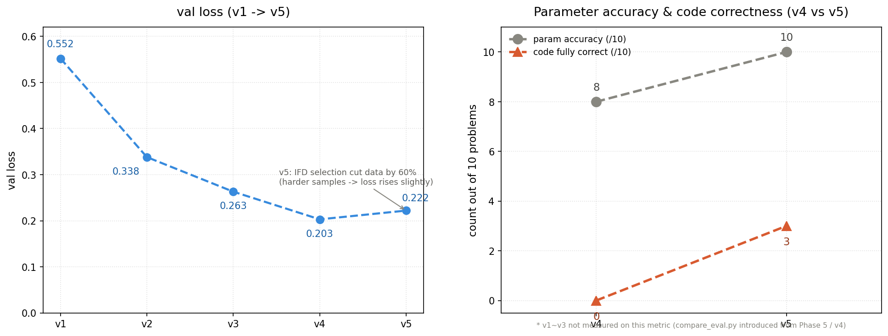

# Coder LLM Finetune

GPT-4o-mini(유료 API)로 동작하는 [ai-coding-test-assistant](https://github.com/HyeonBin0118/ai-coding-test-assistant)를 도메인 특화 파인튜닝 모델로 교체할 수 있는지 검증하는 실험 프로젝트.

**핵심 질문:** "작은 모델(7B)도 좁은 도메인에서 대형 API(GPT-4o-mini)를 대체할 수 있는가?"

RTX 3060 12GB 단일 GPU 환경에서 Qwen2.5-Coder-7B-Instruct를 QLoRA로 파인튜닝하고, 데이터·프롬프트를 한 번에 한 변수씩 변경하며 성능 변화를 정량 측정했다. 이후 논문 기반 데이터 선별 전략(IFD + K-Means)과 DPO를 적용해 코드 생성 품질 개선을 시도한다.

> 실험 설계 의도, 실패 분석, 회고 등 상세 기록은 [PLAN.md](./PLAN.md) 참조.

---

## 결과 요약



| 항목 | v1 | v4 | v5 | DPO |
|---|---|---|---|---|
| val loss | 0.552 | 0.203 | 0.222 | - |
| token accuracy | 87.8% | 91.7%* | **94.1%** | - |
| 파라미터 정확도 | 실패 | 8/10 | **10/10** | - |
| 코드 완전 정답 | 0/10 | 0/10 | **3/10** | 평가 예정 |
| rewards/accuracies | - | - | - | **92.5%** |

*v4 token accuracy는 동일 `val.jsonl` 기준으로 재측정한 값(91.7%)이다. 과거 기록된 95.1%는 측정 방식이 명확하지 않아, `compute_token_accuracy.py`로 재현 가능한 값으로 대체했다.

- **4차례 반복 실험(v1→v4)** 으로 val loss 63% 감소, 파라미터 정확도 문제 완전 해결
- **GPT-4o-mini 정량 비교:** 힌트 태스크에서 응답 속도 15% 우위, 코드 생성에서는 완전 대체 실패
- **논문 기반 개선(v5):** Evol-Instruct 데이터 확장(681→3,848) + IFD+K-Means 40% 선별 → 코드 정답 0→3개, 파라미터 정확도 100%, token accuracy 94.1% 달성
- **DPO 학습 완료:** rewards/accuracies 92.5%, rewards/margins 0.242로 선호도 학습 확인

---

## 기술 스택

| 분류 | 기술 |
|---|---|
| 언어 | Python 3.11 |
| 베이스 모델 | Qwen2.5-Coder-7B-Instruct |
| 파인튜닝 | QLoRA (4bit NF4 + LoRA r=16) |
| 학습 | transformers, peft, trl, accelerate, bitsandbytes |
| 데이터 수집 | Playwright, GitHub REST API |
| 데이터 생성 | GPT-4o-mini (Knowledge Distillation) |
| 데이터 선별 | sentence-transformers, scikit-learn (IFD + K-Means) |
| GPU | RTX 3060 (12GB) |

---

## 파이프라인

```
프로그래머스 문제 수집 (Level 1~2, 228개)
    ↓
힌트/접근법: GPT-4o-mini 생성 (Knowledge Distillation)
정답 코드: GitHub 공개 레포 실제 통과 코드 (2,340개)
    ↓
QLoRA 파인튜닝 → v1 → v2 → v3 → v4 (한 번에 한 변수씩 변경)
    ↓
GPT-4o-mini vs v4 정량 비교
    ↓
Evol-Instruct 데이터 확장 → IFD+K-Means 선별 → v5
    ↓
DPO (chosen/rejected 227쌍) 학습 → rewards/accuracies 92.5%
```

---

## 실험 결과

### 비교 실험 (v1 ~ v4)

학습 설정은 고정하고 데이터·프롬프트만 변경해 각 변수의 영향을 분리 측정했다.

| 실험 | 변경 내용 | 샘플 수 | val loss | token acc | 파라미터 | 로직 |
|---|---|---|---|---|---|---|
| v1 | 기준 (GPT 생성 데이터) | 681 | 0.552 | 87.8% | ❌ | ❌ |
| v2 | 정답을 GitHub 통과 코드로 교체 | 2,783 | 0.338 (-39%) | 92.0% | ❌ | ❌ |
| v3 | 정규식 버그 수정 후 재수집 | 2,796 | 0.263 (-22%) | 93.7% | ❌ | ❌ |
| v4 | 프롬프트에 함수 시그니처 추가 | 2,796 | **0.203 (-23%)** | **91.7%*** | **✅** | ⚠️ |

*v4 token accuracy 91.7%는 `compute_token_accuracy.py`로 동일 `val.jsonl` 기준 재측정한 값. v1~v3는 동일 방식으로 재측정하지 않은 과거 기록 값.

각 버전의 변경 의도와 실패 원인 분석은 [PLAN.md](./PLAN.md) 참조.

### GPT-4o-mini vs 로컬 v4

동일 문제 10개(Level 1×5, Level 2×5) 기준. 스크립트: `compare_eval.py`

**응답 시간**

| 태스크 | GPT-4o-mini | 로컬 v4 | 비교 |
|---|---|---|---|
| 힌트 | 9,839ms | 8,399ms | 로컬 15% 빠름 |
| 접근법 | 9,619ms | 32,837ms | GPT 3.4배 빠름 |
| 정답 코드 | 8,206ms | 11,703ms | GPT 43% 빠름 |

**품질**

| 항목 | GPT-4o-mini | 로컬 v4 |
|---|---|---|
| 힌트 품질 (정성 5점) | 3.9 | 2.9 |
| 파라미터 정확도 | 100% | 80% |
| 코드 완전 정답 | 3 / 10 | 0 / 10 |
| API 비용 | 유료 | 0원 |

> 힌트 태스크는 응답 속도·비용 측면에서 실용 가능. 코드 생성은 7B 모델 한계로 완전 대체 실패.

### 논문 기반 개선 (v5)

**근거 논문:** [Data-efficient LLM Fine-tuning for Code Generation](https://arxiv.org/abs/2504.12687) (arXiv:2504.12687)

| 단계 | 방법 | 결과 |
|---|---|---|
| 데이터 확장 | Evol-Instruct (제약/규모/재귀 변형) | 681 → 3,848개 |
| 데이터 선별 | IFD 점수 + K-Means(k=10) 상위 40% | 3,463 → 1,381개 (39.9%) |
| v5 학습 | 선별 데이터로 QLoRA (34시간) | train loss 0.13, val loss 0.222, token accuracy 94.1% ✅ |

**v4 vs v5 비교 평가 결과** (동일 문제 10개 기준, `compare_v4_v5.py`)

| 항목 | v4 | v5 |
|---|---|---|
| 파라미터 정확도 | 8/10 | **10/10** |
| 코드 완전 정답 | 0/10 | **3/10** |
| hint 응답 시간 | 8,153ms | 177,516ms* |
| solution 응답 시간 | 13,767ms | 119,721ms* |

*응답 시간 증가 원인: MAX_LENGTH=512 학습으로 EOS 생성 타이밍 미학습. 실서비스 적용 시 max_new_tokens=256으로 제한하면 해결 가능.

**v4 vs v5 token accuracy 재평가** (`compute_token_accuracy.py`, 동일 `val.jsonl` 385개 기준)

| 항목 | v4 | v5 |
|---|---|---|
| token accuracy | 91.7% | **94.1%** |

기존 README/PLAN.md에 기록된 v1~v4 token accuracy는 계산 코드가 프로젝트에 남아있지 않아 재현이 불가능했다. 이에 `compute_token_accuracy.py`를 새로 작성해 v4, v5를 동일 기준(다음 토큰 예측 정확도, 4bit 양자화 forward pass)으로 재측정했다.

### DPO 학습

v5 기반으로 227쌍의 chosen/rejected 데이터로 DPO 학습 진행.

| 항목 | 값 |
|---|---|
| 학습 데이터 | chosen/rejected 204쌍 (train) |
| 학습 시간 | 54분 42초 |
| train loss | 0.683 → **0.587** |
| rewards/accuracies | 0.70 → **0.925** |
| rewards/margins | 0.020 → **0.242** (12배) |

rewards/accuracies 92.5%는 모델이 10쌍 중 9쌍에서 효율적인 코드(chosen)를 비효율적인 코드(rejected)보다 높은 확률로 선택함을 의미한다.

---

## 프로젝트 구조

```
coder-llm-finetune/
├── data/
│   ├── crawl_problems.py        # 프로그래머스 문제 URL 수집
│   ├── fetch_problems.py        # 문제 본문 파싱 + SQL 필터링
│   ├── generate_dataset.py      # GPT-4o-mini 힌트/접근법/정답 생성 (v1)
│   ├── collect_github.py        # GitHub 정답 코드 수집
│   ├── build_dataset.py         # GPT 힌트/접근법 + GitHub 정답 결합
│   ├── convert_to_jsonl.py      # 학습 포맷 변환
│   ├── evol_dataset.py          # Evol-Instruct 데이터 확장
│   ├── merge_dataset.py         # 데이터셋 병합
│   ├── ifd_select.py            # IFD + K-Means 선별
│   └── generate_dpo.py          # DPO chosen/rejected 쌍 생성
├── output/                      # LoRA 가중치 (v1~v5, dpo)
├── evaluation/                  # 비교 평가 결과 JSON + 성능 그래프
├── train.py                     # QLoRA 학습 (v1~v5)
├── train_dpo.py                 # DPO 학습
├── compare_eval.py              # GPT vs 로컬 정량 비교
├── compare_v4_v5.py             # v4 vs v5 직접 비교
├── compute_token_accuracy.py    # v4 vs v5 token accuracy 동일 기준 재평가
├── evaluate.py                  # 학습 단계 비교 평가
├── patch.py                     # trl 인코딩 패치 (Windows)
├── requirements.txt
└── PLAN.md                      # 실험 설계·회고 상세 기록
```

---

## 실행 방법

```cmd
conda create -n finetune_env python=3.11 -y
conda activate finetune_env
pip install -r requirements.txt
playwright install chromium
```

`.env` 생성:
```
OPENAI_API_KEY=sk-...
GITHUB_TOKEN=ghp_...
```

```cmd
# v1~v4 파이프라인
python data/crawl_problems.py
python data/fetch_problems.py
python data/generate_dataset.py
python data/collect_github.py
python data/build_dataset.py
python data/convert_to_jsonl.py
python patch.py
python train.py
python compare_eval.py

# v5 (논문 기반 개선)
python data/evol_dataset.py
python data/merge_dataset.py
python data/ifd_select.py
python train.py
python compare_v4_v5.py
python compute_token_accuracy.py

# DPO (별도 환경)
conda create -n dpo_env python=3.11 -y
conda activate dpo_env
pip install torch==2.1.2+cu118 torchvision==0.16.2+cu118 --index-url https://download.pytorch.org/whl/cu118
pip install transformers==4.40.0 peft==0.10.0 trl==0.11.4 accelerate==0.27.2 bitsandbytes==0.43.0 datasets rich python-dotenv
python data/generate_dpo.py
python train_dpo.py
```

---

## 동작 환경

- Windows 10 / 11
- NVIDIA GPU (VRAM 12GB 이상 권장)
- CUDA 11.8
- Python 3.11

---

## 참고 논문

- **Data-efficient LLM Fine-tuning for Code Generation** — Weijie Lv et al., [arXiv:2504.12687](https://arxiv.org/abs/2504.12687) ([code](https://github.com/Kyle-Lyu/data-efficient-finetuning))
- **Finetune-RAG: Fine-Tuning Language Models to Resist Hallucination in RAG** — Zhan Peng Lee et al., [arXiv:2505.10792](https://arxiv.org/abs/2505.10792) ([code](https://github.com/Pints-AI/Finetune-Bench-RAG))

---

## 라이선스

MIT